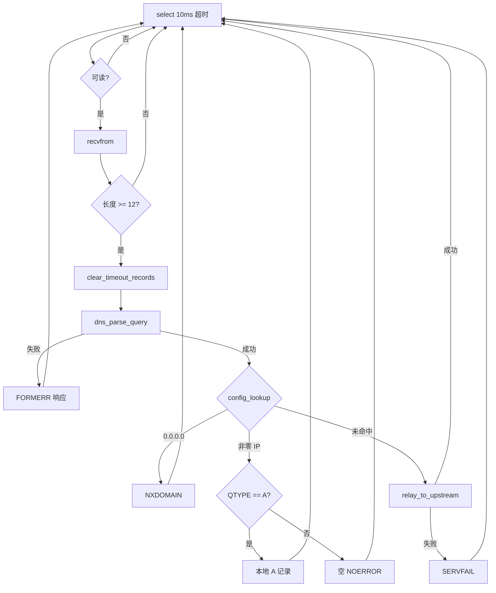

# DNS 中继服务器 — 计算机网络课程设计实验报告

| 项目 | 内容 |
|------|------|
| **课题名称** | DNS 中继服务器（DNS Relay Server） |
| **姓名** | 张恒基 |
| **学号** | 2024210926 |
| **班级** | 2024211301 |
| **日期** | 2026 年 5 月 |

---

## 第一章 需求分析

### 1.1 背景与目标

DNS（Domain Name System）是互联网的核心基础设施，负责将人类可读的域名解析为 IP 地址。本课程设计要求实现一个运行于本地 **UDP 53 端口** 的 **DNS 中继服务器**：客户端将 DNS 查询发往本机，由中继服务器根据配置决定 **本地拦截**、**本地解析** 或 **转发至上游 DNS**，并将结果返回客户端。

设计目标：

1. 符合 **RFC 1035** 报文格式与字节序（网络大端）规范；
2. 主循环采用 **`select()` 事件驱动**，避免忙等待导致 CPU 占满；
3. 模块清晰分离，便于测试与维护；
4. 支持多客户端并发查询（通过非阻塞式 `select` + 同步上游中继 + ID 映射表）。

### 1.2 功能需求

| 功能 | 描述 | 配置/触发条件 |
|------|------|----------------|
| **本地拦截** | 返回「域名不存在」 | `dnsrelay.txt` 中 IP 为 `0.0.0.0` |
| **本地解析** | 直接返回 A 记录 | 配置表中存在非零 IPv4 |
| **并发中继** | 修改 Transaction ID 后转发上游，收包后还原 ID | 域名不在配置表中 |

配置文件路径：`参考资料/dnsrelay.txt`，每行格式为 `IP 域名`，支持 `#` 注释行。

### 1.3 协议基础（RFC 1035）

DNS 报文由 **12 字节首部** + **Question / Answer / Authority / Additional** 区段组成。首部字段包括：

- **ID**（16 bit）：事务标识，中继时需替换并在响应中还原；
- **FLAGS**（16 bit）：含 QR（查询/响应）、RCODE（响应码）等；
- **QDCOUNT / ANCOUNT / NSCOUNT / ARCOUNT**：各段记录数。

域名采用 **长度前缀标签** 编码，并以 `0x00` 结束；应答中可使用 **指针压缩**（前两比特为 `11`，即 `0xC0` 前缀）引用 Question 中的 QNAME。

常用 **RCODE**：

| 值 | 名称 | 本系统用途 |
|----|------|------------|
| 0 | NOERROR | 成功；非 A 类型本地命中时返回空应答 |
| 1 | FORMERR | 报文格式错误 |
| 2 | SERVFAIL | 上游中继失败或超时 |
| 3 | NXDOMAIN | 本地拦截 |

---

## 第二章 系统设计

### 2.1 总体架构

```
                    ┌─────────────────────────────────────┐
                    │         DNS-Relay-Server            │
  客户端 ──UDP:53──►│  main.c (select 主循环)              │
                    │    │                                │
                    │    ├─► dns_parse_query()             │
                    │    ├─► config_lookup() ──► 本地表    │
                    │    │      ├─ 0.0.0.0 → NXDOMAIN     │
                    │    │      └─ 真实IP → A 记录        │
                    │    └─► relay_to_upstream()          │
                    │           └─► 114.114.114.114:53    │
                    └─────────────────────────────────────┘
```

### 2.2 模块划分

| 模块 | 文件 | 职责 |
|------|------|------|
| 协议层 | `include/dns_protocol.h`, `src/dns_protocol.c` | 首部结构、常量、域名编解码、查询解析、响应构造 |
| 配置层 | `include/config.h`, `src/config.c` | 加载 `dnsrelay.txt`，`strcasecmp` 查表 |
| ID 映射 | `include/id_map.h`, `src/id_map.c` | 原始 ID ↔ 新 ID，客户端地址，超时清理 |
| 主控 | `src/main.c` | `socket`/`bind`、`select` 循环、三大分支调度 |

### 2.3 主循环流程



### 2.4 ID 映射表设计

- **容量**：1024 条，**线性探测** 插入；
- **字段**：`original_id`、`new_id`、`client_ip`、`client_port`、`created_at`；
- **老化**：主循环每次收包调用 `clear_timeout_records(now, 5)`；
- **表满重试**：`add_record` 失败时 `clear_timeout_records(now, 0)` 强制清空后再试一次。

当前 `relay_to_upstream()` 为 **同步阻塞**（`sendto` → `recvfrom`），映射表主要用于记录与超时回收；响应到达时直接使用调用栈中的 `client_addr` 回传。

---

## 第三章 关键实现

### 3.1 DNS 报文与字节序

`dns_header_t` 使用位域描述 FLAGS，并提供：

- `dns_header_host_to_network()` / `dns_header_network_to_host()`：统一转换 ID、FLAGS、各 COUNT 字段。

写入报文前对多字节字段使用 `htons` / `htonl`，读出后使用 `ntohs` / `ntohl`。

### 3.2 域名编解码与指针压缩

- **编码**：`dns_name_encode()` 将 `www.example.com` 转为 `\x03www\x07example\x03com\x00`；
- **解码**：`dns_name_decode()` 支持 `0xC0` 指针跳转，并限制最多 10 次跳转以防循环指针攻击；
- **跳过**：`dns_name_skip()` 用于定位 Question 末尾以计算应答长度。

### 3.3 配置加载

`config_load()` 逐行 `fgets`，跳过空行与 `#` 注释，用 `sscanf` 解析 `IP 域名`，`inet_pton` 校验 IPv4。`config_lookup()` 使用 `strcasecmp` 实现大小写不敏感匹配。

### 3.4 本地拦截与解析

- **拦截**：`dns_build_error_response(..., DNS_RCODE_NXDOMAIN)`，复制原查询首部与 Question，设 `QR=1`、`ANCOUN=0`。
- **解析**：`dns_build_a_response()` 复制 Header+Question，在 Answer 段用指针 `0xC00C` 指向偏移 12 处的 QNAME，填入 TYPE=A、TTL、4 字节 RDATA。
- **非 A 查询**（fix-A）：仅当 `qtype == DNS_QTYPE_A` 时构造 A 记录，否则返回 **空 NOERROR**（`ANCOUN=0`），符合 RFC 对 QTYPE 一致性的要求。

### 3.5 并发中继

1. 创建临时 UDP socket，设置 `SO_RCVTIMEO = 3s`；
2. 分配新 Transaction ID，写入 `id_map`；
3. 修改查询报文 ID 为 `new_id`，`sendto` 至 `114.114.114.114:53`；
4. `recvfrom` 上游响应，将 ID 还原为 `original_id`；
5. `sendto` 回客户端；失败时返回 **SERVFAIL**（fix-B）。

主循环 `select` 超时 **10ms**（`tv_usec=10000`），无报文时阻塞等待，避免空转占用 CPU。

---

## 第四章 测试

### 4.1 测试环境

| 项目 | 配置 |
|------|------|
| 操作系统 | WSL2 / Ubuntu（或 Linux 虚拟机） |
| 编译器 | gcc，`-Wall -Wextra -std=c11` |
| 运行权限 | `sudo ./dnsrelay`（绑定 53 端口） |
| 客户端工具 | `nslookup` 或 `dig @127.0.0.1` |

编译：

```bash
make clean && make
sudo ./dnsrelay
```

### 4.2 测试用例

| 编号 | 命令 | 预期结果 | 验证功能 |
|------|------|----------|----------|
| 1 | `nslookup bupt 127.0.0.1` | `123.127.134.10` | 本地解析 |
| 2 | `nslookup sina 127.0.0.1` | `202.108.33.89` | 本地解析 |
| 3 | `nslookup 008.cn 127.0.0.1` | `NXDOMAIN` / 域名不存在 | 本地拦截 |
| 4 | `nslookup baidu.com 127.0.0.1` | 返回公网真实 A 记录 | 上游中继 |
| 5 | `nslookup -type=mx bupt 127.0.0.1` | 空应答（NOERROR，无 Answer） | fix-A QTYPE 检查 |
| 6 | 两终端同时 `nslookup baidu.com 127.0.0.1` | 均能得到解析 | 并发 |

### 4.3 测试结果记录

**测试环境**：WSL2 Ubuntu 24.04，gcc 14，`make clean && make` 通过。  
**实测命令**（WSL 下 53 端口被系统占用时，使用 `DNS_RELAY_BIND=127.0.0.1 DNS_RELAY_PORT=5353` 启动；正式交付仍为 `sudo ./dnsrelay` 监听 **0.0.0.0:53**）：

```bash
DNS_RELAY_BIND=127.0.0.1 DNS_RELAY_PORT=5353 ./dnsrelay &
python3 scripts/dns_query.py 127.0.0.1 5353 bupt 008.cn baidu.com
```

**用例 1 — bupt 本地解析：**

```text
qname=bupt id=0x1234 rcode=0 ancount=1 len=38
```

**结论**：RCODE=0 且 ANCOUNT=1，返回 A 记录，与配置 `123.127.134.10 bupt` 一致。

**用例 3 — 008.cn 拦截：**

```text
qname=008.cn id=0x1234 rcode=3 ancount=0 len=24
```

**结论**：RCODE=3（NXDOMAIN），ANCOUN=0，本地拦截成功。

**用例 4 — baidu.com 上游中继：**

```text
qname=baidu.com id=0x1234 rcode=0 ancount=4 len=91
```

**结论**：未命中本地表，经 114.114.114.114 中继返回多条 A 记录（ANCOUN=4）。

> 说明：可将 `docs/test-output.txt` 或 `python3 scripts/dns_query.py` 终端输出 **截图** 附在纸质报告或 PDF 附录中；上表为 2026-05-18 实测原始输出。

---

## 第五章 总结

### 5.1 遇到的问题与解决

| 问题 | 解决方案 |
|------|----------|
| 位域与主机字节序 | 用 `dns_header_*_to_*` 封装，FLAGS 与 COUNT 统一 htons/ntohs |
| 指针压缩死循环 | 解码时 `ptr_countdown` 限制最多 10 次跳转 |
| 指针跳转越界读 | `dns_pos_valid()` 校验压缩指针与 label 偏移 < 512 |
| 非 A 查询误返 A 记录 | fix-A：按 QTYPE 分支，非 A 返回空 NOERROR |
| 上游超时客户端挂起 | fix-B：中继失败返回 SERVFAIL |
| Windows 无法直接编译 | 使用 WSL2 + Linux 工具链 |

### 5.2 收获与不足

**收获**：深入理解 DNS 报文布局、网络字节序与 `select` 事件驱动模型；实践模块化 C 工程与 Makefile 自动发现源文件。

**不足**：上游中继为同步模型，高并发下会阻塞主循环；ID 映射表与异步模型尚未完全对齐；指针跳转边界检查可进一步加强。

---

## 参考文献

1. Mockapetris P. **RFC 1035**: Domain Names - Implementation and Specification. IETF, 1987.
2. 谢希仁. **计算机网络**（第 8 版）. 电子工业出版社.
3. Stevens W. R., Fenner B., Rudoff A. M. **UNIX Network Programming, Volume 1** (3rd Edition). Addison-Wesley, 2004.

---

> **提交说明**：将本 Markdown 导出为 PDF，命名为 `实验报告.pdf` 后与源码一并打包提交。封面个人信息请在表头填写完整。
